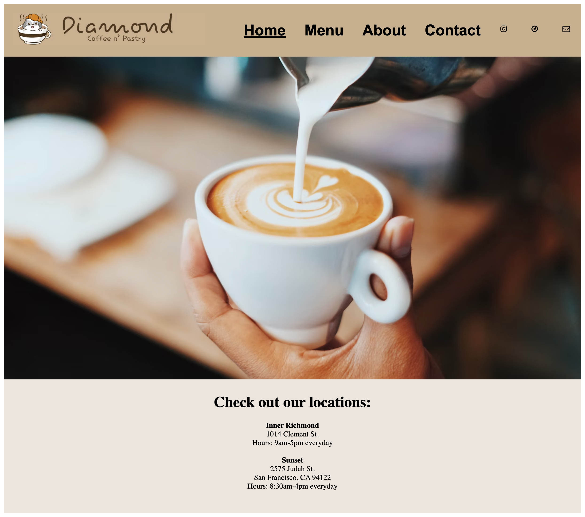

# Bootcamp_CodeExamples

<strong>Html, css, and javascript practice projects and end project for online bootcamp to display current skills for future jobs and/or internships in front end web development. </strong> 

     

<em>Week 1:</em>
<a href="https://github.com/briannaodom2021/Bootcamp_CodeExamples/blob/main/profile/profile.html"> Assignment 1 </a>  was to put together an online portfolio that was a mini bio about us as people that included headers, unordered and ordered lists, music and image importation, basic styling, and use of hyperlinks.

<h2>Result for Assignment 1:</h2>

 

     

<em>Week 1:</em>
<a href="https://github.com/briannaodom2021/Bootcamp_CodeExamples/blob/main/example-folder/install-extension.html"> Assignment 2 </a> involved working with a navigation bar at the top of the page that allowed you to jump down the page to where you want depending on what menu item you clicked. It also had use make ordered and unordered lists, include a hyperlink and mini icon, and adding a video and full sized image to the page. Headers were important as well. 

<h2>Result for Assignment 2:</h2>

 

     

<em>Week 2:</em>
<a href="https://github.com/briannaodom2021/Bootcamp_CodeExamples/blob/main/css-practice/css-practice.html"> Assignment 3 </a> css practice in class that had us set up menu items with a table that included prices, add a scale for a rating submit, include a field option for name, and list contact information with address and href tags.  

<h2>Result for Assignment 3:</h2>

 

     

<em>Week 2:</em>
<a href="https://github.com/briannaodom2021/Bootcamp_CodeExamples/blob/main/css-example/survey.html"> Assignment 4 </a> was more css practice similar to assignment 3 but more options with checklists and radio buttons. 

<h2>Result for Assignment 4:</h2>

 

     

<em>Week 2:</em>
<a href="https://github.com/briannaodom2021/Bootcamp_CodeExamples/blob/main/workshop2/datingform.html"> Assignment 5 </a> was our last css assignment that was setting up an extended dating form shown below.

<h2>Result for Assignment 5:</h2>

 

     

<em>Week 3:</em>
<a href="https://github.com/briannaodom2021/Bootcamp_CodeExamples/blob/main/js_projects/theater.html"> Assignment 6</a> was javascript practice making a separate <a href="https://github.com/briannaodom2021/Bootcamp_CodeExamples/blob/main/js_projects/js/theater.js">js folder</a>. We took in user inputs for a fake movie showing in order to tell them what the price of their ticket would be. If they saw a matinee it would be $3 cheaper on their ticket. If they were ages 12 to 65 their tickets were orignally $20. Otherwise the person's ticket was $10. These prices are without the discount. 

My code handled checking if user input was valid i.e. was actually a number for age and if the user typed yes (y) or no (n).

<h2>Result for Assignment 6:</h2>

 
<a href="https://vimeo.com/785078742"> Watch video here</a>

     

<em>Week 3:</em>
<a href="https://github.com/briannaodom2021/Bootcamp_CodeExamples/blob/main/js_projects/number-guessing-game.html"> Assignment 7 </a> was more javascript practice with a separate<a href="https://github.com/briannaodom2021/Bootcamp_CodeExamples/blob/main/js_projects/js/number-guessing-game.js"> js file </a>making a number guessing game where a prompt asks a user to guess a number I'm thinking of. The user has to choose a number 1-10. If they get it correct, the game will congradulate them and tell them how many tries it took to get the number right. If not, it will say their guess is too high or too low. 

My code handles also checking if user input was valid i.e. was actually a number.

<h2>Result for Assignment 7:</h2>

 
<a href="https://vimeo.com/785490286"> Watch video here</a>

     

<em>Week 3:</em>
<a href="https://github.com/briannaodom2021/Bootcamp_CodeExamples/blob/main/js_projects/color-guessing-game.html"> Assignment 8 </a> was another javascript practice which was similar to assignment 7. This instead as a color guessing game. The colors were provided to choose from. If the use chose the right color, they'd be congradulated and told how many tries it took to find the right guess. When they pressed ok, the screen would also change to that found color. If they were wrong, the game would tell them their guess was too high or too low based on where the color fell alphabetically. 

My code handles also checking if user input was valid i.e. was actually a string and if that string had a color that was one of the options given. If not, those errors would be shown. 

Note: only html doc for this assignment. 

<h2>Result for Assignment 8:</h2>

 
<a href="https://vimeo.com/785490180"> Watch video here</a>

     

<em>Week 4:</em>
<a href="https://github.com/briannaodom2021/Bootcamp_CodeExamples/blob/main/js_projects/dice-game.html"> Assignment 9 </a> was more javascript practice of setting up a dice game with another <a href="https://github.com/briannaodom2021/Bootcamp_CodeExamples/blob/main/js_projects/js/dice-game.js"> js folder </a>. A player would start and there would be a max of 10 rolls. The game would end early if a player landed on die 1. The game rewarded the player gold coins depending on which side of the die the player landed on. The total would be given at the end of the game.

<h2>Result for Assignment 9:</h2>

 
<a href="https://vimeo.com/785653632"> Watch video here</a>

# Personal Projects 

Currently working on personal projects to enhance my skills which for the time being includes the use of css, html, javascript, and a little jquery. 

The first project is a redo of a coffee shop website. My friend redesigned the site with figma and sent me her design outline with the parameters, colors, and images she wanted to use. Currently still in progress. 

Below is the example of the home page. A video link will be added soon to show the rest of the site and functionality. 

Note: I am using internal style sheets to quickly go through phase 1 of coding. 

</img>
<a href="https://github.com/briannaodom2021/Bootcamp_CodeExamples/tree/main/coffee-website">Link to coffee-website code></a>

